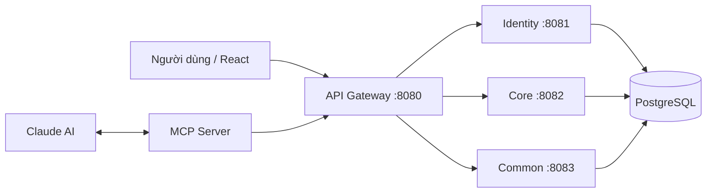
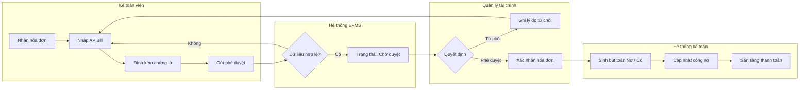
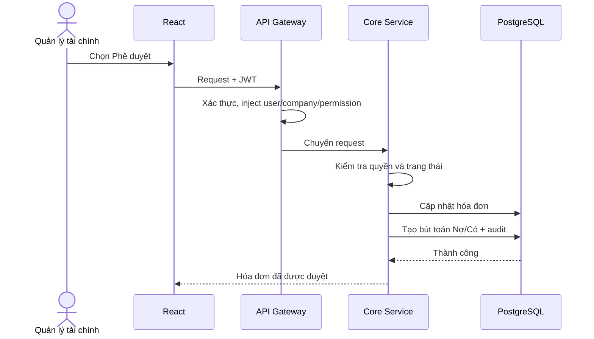
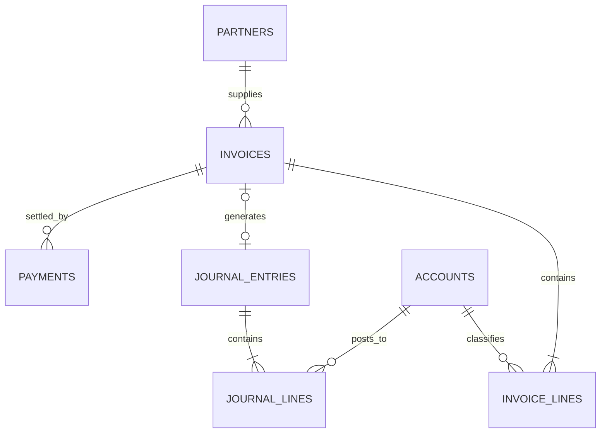
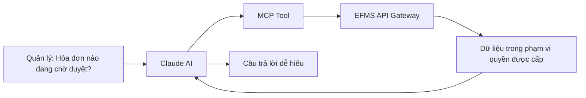

# Nội dung 18 slide bảo vệ EFMS

**Thời lượng mục tiêu:** 15 phút  
**Mạch trình bày:** Vấn đề thực tế → giải pháp EFMS → phân tích, thiết kế → quy trình AP Bill → kết quả xây dựng → AI Agent → kiểm thử → kết luận.

---

## Slide 1. Xây dựng hệ thống quản lý tài chính nội bộ doanh nghiệp tích hợp trợ lý AI Agent

**Mục tiêu:** Giới thiệu đề tài và định vị bài toán.

**Nội dung trên slide**

- Trường Đại học Công nghệ Giao thông Vận tải
- Khoa Công nghệ thông tin
- Sinh viên: Đinh Việt Linh
- Giảng viên hướng dẫn: Lê Thị Chi
- Hà Nội, 2026

**Visual:** Logo trường, tên đề tài; nền tối giản có hình minh họa dòng tiền, chứng từ và AI.

**Lời thoại — 30 giây**

> Em xin kính chào quý thầy cô trong Hội đồng. Em là Đinh Việt Linh. Hôm nay em xin trình bày đồ án “Xây dựng hệ thống quản lý tài chính nội bộ doanh nghiệp tích hợp trợ lý AI Agent”. Đề tài tập trung giải quyết quy trình tài chính thường xuyên trong doanh nghiệp, đặc biệt là quản lý hóa đơn, phê duyệt, thanh toán và hạch toán, đồng thời hỗ trợ người quản lý tra cứu dữ liệu bằng ngôn ngữ tự nhiên.

**Chuyển ý:** Trước tiên, em xin trình bày ngắn gọn cấu trúc của báo cáo.

**Nguồn:** PDF trang 1-2.

---

## Slide 2. Báo cáo đi từ bài toán nghiệp vụ đến hệ thống đã xây dựng

**Mục tiêu:** Cho Hội đồng thấy cấu trúc bốn chương.

**Nội dung trên slide**

1. Tổng quan đề tài
2. Cơ sở lý thuyết và công nghệ
3. Phân tích, thiết kế hệ thống
4. Xây dựng và kiểm thử

**Visual:** Timeline bốn chặng; tô đậm Chương 3.

**Lời thoại — 25 giây**

> Nội dung báo cáo gồm bốn phần. Chương 1 trình bày vấn đề, mục tiêu và phạm vi. Chương 2 giới thiệu những nền tảng kỹ thuật trực tiếp phục vụ bài toán. Chương 3 là phần trọng tâm, mô tả tác nhân, kiến trúc, dữ liệu và quy trình phê duyệt hóa đơn. Cuối cùng, Chương 4 trình bày sản phẩm đã xây dựng, tích hợp AI và kết quả kiểm thử.

**Chuyển ý:** Để thấy lý do cần EFMS, em xin bắt đầu từ một tình huống rất phổ biến trong doanh nghiệp.

**Nguồn:** PDF trang 7-8.

---

## Slide 3. Quy trình tài chính rời rạc làm tăng thời gian và rủi ro

**Mục tiêu:** Giúp Hội đồng hiểu “nỗi đau” trước khi nghe giải pháp.

**Nội dung trên slide**

- Hóa đơn, file và trao đổi nằm nhiều nơi
- Phê duyệt thủ công, khó theo dõi trạng thái
- Dữ liệu giữa các công ty dễ bị lẫn
- Khó truy vết người sửa và lịch sử thay đổi
- Tổng hợp công nợ mất thời gian

**Visual:** Sơ đồ “Trước EFMS”: Email → Excel → giấy tờ → chat → kế toán.

**Lời thoại — 50 giây**

> Trong một quy trình mua hàng, kế toán nhận hóa đơn từ nhà cung cấp, kiểm tra thông tin, gửi quản lý phê duyệt, sau đó mới được ghi nhận công nợ và thanh toán. Nếu dữ liệu nằm rời rạc trong email, Excel, giấy tờ và các nhóm chat thì người quản lý khó biết hóa đơn đang ở bước nào, ai đã sửa dữ liệu và vì sao bị từ chối. Đồng thời, nếu không có phân quyền rõ ràng, người không có trách nhiệm vẫn có thể xem hoặc thay đổi dữ liệu nhạy cảm. Vì vậy, bài toán không chỉ là lưu hóa đơn, mà là kiểm soát toàn bộ vòng đời của một giao dịch tài chính.

**Chuyển ý:** Từ những vấn đề đó, em xác định mục tiêu và phạm vi cụ thể cho đồ án.

**Nguồn:** PDF trang 9.

---

## Slide 4. EFMS tập trung hóa dữ liệu và kiểm soát vòng đời giao dịch

**Mục tiêu:** Nêu rõ hệ thống giải quyết gì và chưa giải quyết gì.

**Nội dung trên slide**

- Quản lý người dùng, vai trò và quyền
- Quản lý đối tác, tài khoản, hóa đơn, thanh toán
- Phê duyệt AP Bill và sinh bút toán tự động
- File, bình luận và nhật ký thay đổi
- AI hỗ trợ tra cứu, không thay người phê duyệt

**Phạm vi chưa hoàn thiện:** Mobile, MFA/OTP, đối soát ngân hàng, báo cáo tài chính chuyên sâu, Camunda 8.

**Visual:** Hai vùng “Đã triển khai” và “Hướng phát triển”.

**Lời thoại — 50 giây**

> EFMS được xây dựng để tập trung hóa dữ liệu tài chính và phân quyền theo vai trò. Kế toán viên chịu trách nhiệm lập và cập nhật hóa đơn; Quản lý tài chính chịu trách nhiệm kiểm tra, phê duyệt và quản lý các danh mục tài chính; Quản trị hệ thống quản lý người dùng, vai trò và quyền. Hệ thống còn hỗ trợ file đính kèm, bình luận và lưu vết thay đổi. Luồng AP Bill được kiểm soát từ bản nháp đến chờ duyệt, phê duyệt và sinh bút toán. AI hỗ trợ tra cứu và phân tích; quyết định cuối cùng vẫn thuộc người có thẩm quyền.

**Chuyển ý:** Để thực hiện phạm vi này, em lựa chọn một số nền tảng lý thuyết và quyết định kiến trúc.

**Nguồn:** PDF trang 10-12, 93-94.

---

## Slide 5. Ba nguyên tắc thiết kế bảo vệ tính đúng đắn của tài chính

**Mục tiêu:** Giải thích lý thuyết qua giá trị nghiệp vụ.

**Nội dung trên slide**

- Microservices: tách ranh giới nghiệp vụ
- RBAC + JWT: đúng người, đúng quyền
- Kế toán kép: tổng Nợ luôn bằng tổng Có
- Phân tách nhiệm vụ: người lập khác người duyệt
- Audit log: truy vết trước và sau thay đổi
- Dữ liệu tiền tệ: dùng kiểu số chính xác

**Visual:** Năm khối nguyên tắc bao quanh biểu tượng hóa đơn.

**Lời thoại — 50 giây**

> Đồ án dựa trên năm nguyên tắc chính. Thứ nhất, Microservices tách các miền chức năng thành ranh giới rõ ràng. Thứ hai, JWT và RBAC bảo đảm mỗi thao tác gắn với đúng người dùng và đúng quyền. Thứ ba, người lập hóa đơn không đồng thời là người phê duyệt. Thứ tư, nghiệp vụ tuân theo kế toán kép và lưu vết thay đổi. Cuối cùng, các giá trị tiền tệ sử dụng kiểu số thập phân chính xác nhằm tránh sai số làm tròn.

**Chuyển ý:** Những nguyên tắc này được hiện thực bằng stack công nghệ sau.

**Nguồn:** PDF trang 12-20, 80-82.

---

## Slide 6. Công nghệ được chọn theo yêu cầu bảo mật và tính chính xác

**Mục tiêu:** Trình bày stack ngắn gọn, tránh liệt kê.

**Nội dung trên slide**

- React + Vite: giao diện SPA
- Java 21 + Spring Boot 3.3.x
- Spring Cloud Gateway + Spring Security
- PostgreSQL: ACID, JSONB, `NUMERIC`
- MCP Server: kết nối Claude AI

**Visual:** Sơ đồ lớp Frontend → Gateway → Services → PostgreSQL; MCP đặt cạnh Core.

**Lời thoại — 45 giây**

> Frontend sử dụng React và Vite để xây dựng ứng dụng một trang. Backend sử dụng Java 21 và Spring Boot 3.3.x vì hệ sinh thái này hỗ trợ tốt bảo mật, giao dịch và kiến trúc dịch vụ. Spring Cloud Gateway là cửa vào duy nhất của hệ thống. PostgreSQL được chọn nhờ giao dịch ACID, kiểu số chính xác cho tiền tệ và JSONB cho audit log. Cuối cùng, MCP Server tạo một lớp trung gian có kiểm soát giữa Claude AI và các API nghiệp vụ.

**Chuyển ý:** Từ yêu cầu nghiệp vụ, hệ thống xác định ba nhóm người dùng chính.

**Nguồn:** PDF trang 14-18, 80.

---

## Slide 7. Ba vai trò cùng tham gia nhưng có trách nhiệm khác nhau

**Mục tiêu:** Làm rõ actors trước khi trình bày use case.

**Nội dung trên slide**

| Vai trò | Trách nhiệm chính |
|---|---|
| Kế toán viên | Tạo, xem, cập nhật hóa đơn; tra cứu dữ liệu tham chiếu |
| Quản lý tài chính | Phê duyệt hóa đơn; quản lý danh mục và thanh toán |
| Quản trị hệ thống | Quản lý người dùng, vai trò và quyền |

**Visual:** Ba persona; bên dưới là dải chức năng chung.

**Lời thoại — 45 giây**

> Hệ thống có ba tác nhân chính. Kế toán viên tạo, xem và cập nhật hóa đơn; đồng thời được đọc tài khoản kế toán, đối tác, thanh toán và tài khoản ngân hàng để lấy dữ liệu tham chiếu khi nhập liệu. Kế toán viên không có quyền phê duyệt. Quản lý tài chính xem và phê duyệt hóa đơn, xử lý trường hợp cần hủy hoặc xóa, đồng thời quản lý tài khoản kế toán, đối tác, thanh toán và tài khoản ngân hàng. Quản trị hệ thống quản lý người dùng, vai trò và quyền. Cách phân chia này bảo đảm người lập và người duyệt là hai vai trò khác nhau.

**Chuyển ý:** Từ ba vai trò này, các chức năng được chia thành ba nhóm nghiệp vụ.

**Nguồn:** PDF trang 21-23.

---

## Slide 8. Chức năng được tổ chức theo ba miền nghiệp vụ

**Mục tiêu:** Thay use case dày đặc bằng sơ đồ dễ đọc.

**Nội dung trên slide**

- Identity: xác thực, người dùng, vai trò, quyền
- Core: tài khoản, đối tác, hóa đơn, thanh toán
- Common: file, bình luận, audit
- Mọi yêu cầu đi qua API Gateway

**Visual:** Use case rút gọn gồm ba cụm; actor nối vào cụm liên quan.

**Lời thoại — 45 giây**

> Thay vì đưa toàn bộ use case chi tiết lên một slide, em nhóm chức năng thành ba miền. Identity quản lý xác thực, người dùng, vai trò và quyền. Core xử lý tài khoản kế toán, đối tác, hóa đơn, thanh toán và tài khoản ngân hàng. Common cung cấp file đính kèm, bình luận và cơ chế lưu vết. Trong Core, Kế toán viên chủ yếu lập hóa đơn; Quản lý tài chính quản lý các danh mục còn lại và thực hiện phê duyệt.

**Chuyển ý:** Cách chia chức năng này được phản ánh trực tiếp trong kiến trúc triển khai.

**Nguồn:** PDF trang 22-23.

---

## Slide 9. API Gateway bảo vệ bốn dịch vụ độc lập của EFMS

**Mục tiêu:** Giải thích kiến trúc bằng luồng request.

**Nội dung trên slide**

- Gateway `8080`: định tuyến và xác thực JWT
- Identity `8081`: người dùng, vai trò, RBAC
- Core `8082`: nghiệp vụ tài chính
- Common `8083`: file, bình luận, audit
- PostgreSQL lưu dữ liệu theo miền

**Visual đề xuất**

**Lời thoại — 55 giây**

> Khi người dùng thao tác trên React, request trước tiên đi vào Gateway. Gateway kiểm tra JWT, lấy thông tin người dùng và danh sách quyền, sau đó chuyển request đến service phù hợp. Identity quản lý người dùng và RBAC; Core xử lý hóa đơn, thanh toán và bút toán; Common quản lý file và bình luận. Ví dụ, quyền tạo hóa đơn được cấp cho Kế toán viên, còn quyền phê duyệt được cấp cho Quản lý tài chính. MCP Server cũng gọi vào hệ thống qua lớp API được kiểm soát, thay vì cho AI truy cập trực tiếp cơ sở dữ liệu.

**Chuyển ý:** Trên kiến trúc đó, em chọn AP Bill làm luồng nghiệp vụ trọng tâm để phân tích.

**Nguồn:** PDF trang 80-82.

---

## Slide 10. AP Bill được kiểm soát từ tiếp nhận đến ghi sổ

**Mục tiêu:** Giải thích toàn bộ quy trình bằng ngôn ngữ nghiệp vụ.

**Nội dung trên slide**

- Kế toán tiếp nhận và nhập hóa đơn
- Hệ thống kiểm tra dữ liệu bắt buộc
- Quản lý phê duyệt hoặc từ chối
- Khi duyệt, hệ thống sinh bút toán
- Toàn bộ thay đổi được ghi audit

**Visual đề xuất: swimlane process**

**Lời thoại — 75 giây**

> Đây là quy trình nghiệp vụ trọng tâm của đồ án. Kế toán viên có quyền tạo, xem và cập nhật AP Bill, đồng thời đọc danh mục đối tác và tài khoản để chọn dữ liệu phù hợp. Sau khi hoàn tất, kế toán gửi hóa đơn sang trạng thái chờ duyệt nhưng không thể tự phê duyệt. Quản lý tài chính có quyền xem và thực hiện bước phê duyệt hoặc từ chối. Quyền hủy hoặc xóa của Quản lý tài chính chỉ phục vụ xử lý ngoại lệ và vẫn phải tuân theo trạng thái chứng từ. Nếu được duyệt, hệ thống tiếp tục cập nhật nghiệp vụ và lưu lại lịch sử thao tác.

**Chuyển ý:** Ở mức kỹ thuật, một lần phê duyệt trên giao diện được xử lý qua nhiều thành phần.

**Nguồn:** PDF trang 38-43, 62, 81-82.

---

## Slide 11. Một thao tác phê duyệt đi qua bốn lớp kiểm soát

**Mục tiêu:** Kết nối hành động nghiệp vụ với sequence kỹ thuật.

**Nội dung trên slide**

1. Gateway xác thực JWT
2. Core kiểm tra quyền và trạng thái
3. Database cập nhật hóa đơn
4. Hệ thống sinh journal entry và audit

**Visual đề xuất**

**Lời thoại — 60 giây**

> Khi Quản lý tài chính nhấn phê duyệt, frontend gửi request kèm JWT đến Gateway. Gateway xác thực token và truyền thông tin người dùng cùng các quyền xuống Core Service. Core kiểm tra người dùng có quyền `FINANCE_MANAGER_REVIEW` và hóa đơn đang ở trạng thái chờ duyệt hay không rồi mới cập nhật. Kế toán viên không có quyền này nên dù gọi trực tiếp API cũng bị từ chối. Phiên bản hiện tại quản lý trạng thái bằng DB State Machine; Camunda 8 là hướng mở rộng, chưa phải thành phần đã tích hợp.

**Chuyển ý:** Để quy trình trên nhất quán, mô hình dữ liệu phải liên kết hóa đơn với bút toán và thanh toán.

**Nguồn:** PDF trang 40-42, 52-60, 81-82, 93-94.

---

## Slide 12. Dữ liệu nối hóa đơn với công nợ và sổ cái

**Mục tiêu:** Trình bày ERD rút gọn theo câu chuyện nghiệp vụ.

**Nội dung trên slide**

- `partners`: nhà cung cấp/khách hàng
- `invoices` và `invoice_lines`: chứng từ
- `journal_entries` và `journal_lines`: hạch toán
- `payments`: thu/chi và phân bổ hóa đơn
- Giá trị tiền dùng `NUMERIC(18,2)`

**Visual đề xuất**

**Lời thoại — 60 giây**

> Mô hình này chỉ giữ những bảng cần để hiểu quy trình. Một đối tác có nhiều hóa đơn; mỗi hóa đơn có các dòng chi tiết. Khi được duyệt, hóa đơn có thể sinh một chứng từ kế toán gồm nhiều dòng Nợ và Có. Thanh toán liên kết với hóa đơn để theo dõi số đã trả và số còn nợ. Các giá trị tiền sử dụng `NUMERIC(18,2)` và `BigDecimal`, không dùng `float` hoặc `double`, nhằm bảo đảm tính chính xác khi cộng dồn nhiều giao dịch.

**Chuyển ý:** Bên cạnh tính đúng đắn dữ liệu, EFMS còn kiểm soát người nào được phép nhìn và thay đổi dữ liệu đó.

**Nguồn:** PDF trang 67-79.

---

## Slide 13. Bảo mật được thực hiện xuyên suốt từ Gateway đến dữ liệu

**Mục tiêu:** Làm rõ cách RBAC bảo vệ từng thao tác nghiệp vụ.

**Nội dung trên slide**

- Lớp 1: Gateway xác minh JWT
- Lớp 2: truyền user, company và permission
- Lớp 3: tạo Security Context tại service
- Lớp 4: `@PreAuthorize` kiểm tra permission
- Audit log ghi người thực hiện thay đổi

**Visual:** Lá chắn bốn lớp; ở giữa là bản ghi của một công ty.

**Lời thoại — 60 giây**

> EFMS áp dụng bốn lớp kiểm soát. Gateway xác minh chữ ký và thời hạn token. Thông tin người dùng và permission được truyền vào service để tạo Security Context. `@PreAuthorize` tiếp tục kiểm tra quyền trên từng API. Ví dụ, Kế toán viên có `INVOICE:CREATE`, `READ` và `UPDATE`; Quản lý tài chính có `INVOICE:READ` và `FINANCE_MANAGER_REVIEW`. Vì vậy, đăng nhập thành công chưa đồng nghĩa người dùng được thực hiện mọi chức năng.

**Chuyển ý:** Sau phần phân tích và thiết kế, em xin trình bày các giao diện đã xây dựng.

**Nguồn:** PDF trang 15-16, 64-79, 81.

---

## Slide 14. Giao diện bám theo công việc hằng ngày của từng vai trò

**Mục tiêu:** Cho thấy sản phẩm thực tế, không trình diễn quá nhiều màn hình.

**Nội dung trên slide**

- Dashboard: tình hình hóa đơn và công nợ
- Danh sách hóa đơn: lọc theo loại, trạng thái
- Form hóa đơn: đối tác, dòng tiền, tài khoản
- Quản trị người dùng, vai trò và quyền

**Visual:** Bốn ảnh chụp có số thứ tự; phóng lớn màn hình hóa đơn.

**Lời thoại — 55 giây**

> Giao diện được tổ chức theo tác vụ và quyền của từng vai trò. Kế toán viên nhìn thấy chức năng tạo và cập nhật hóa đơn, nhưng không có nút phê duyệt. Quản lý tài chính có danh sách hóa đơn chờ duyệt và các màn hình quản lý tài khoản, đối tác, thanh toán và tài khoản ngân hàng. Quản trị viên sử dụng màn hình người dùng, vai trò và permission để cấu hình ai được đọc, tạo, cập nhật hoặc phê duyệt từng tài nguyên.

**Chuyển ý:** Ngoài giao diện truyền thống, hệ thống còn cung cấp một cách tương tác khác qua AI Agent.

**Nguồn:** PDF trang 82-90.

---

## Slide 15. AI Agent tra cứu EFMS qua các công cụ được kiểm soát

**Mục tiêu:** Giải thích AI theo cách thực tế, tránh phóng đại.

**Nội dung trên slide**

- Người dùng đặt câu hỏi tự nhiên
- Claude chọn MCP tool phù hợp
- MCP gọi API bằng quyền người dùng
- EFMS trả dữ liệu có cấu trúc
- AI tổng hợp; con người quyết định

**Visual đề xuất**

**Lời thoại — 60 giây**

> Điểm nhấn của đồ án là tích hợp Claude AI qua MCP Server. Ví dụ, quản lý có thể hỏi “Những hóa đơn AP nào đang chờ duyệt?”. Claude không truy cập trực tiếp database mà chọn một tool đã được định nghĩa. MCP Server gọi API EFMS bằng thông tin xác thực của người dùng, vì vậy vẫn chịu kiểm soát xác thực và phân quyền như giao diện thông thường. Dữ liệu trả về có cấu trúc, sau đó AI mới tổng hợp thành câu trả lời dễ hiểu. AI hỗ trợ tìm kiếm và phân tích nhanh hơn, nhưng không tự ý phê duyệt một giao dịch tài chính.

**Chuyển ý:** Các chức năng cốt lõi được kiểm tra bằng những tình huống thành công và ngoại lệ.

**Nguồn:** PDF trang 16-17, 82, 87, 93.

---

## Slide 16. Kiểm thử tập trung vào xác thực, phân quyền và AP Bill

**Mục tiêu:** Trình bày bằng kịch bản, không tuyên bố quá mức.

**Nội dung trên slide**

| Nhóm | Kịch bản chính | Kết quả |
|---|---|---|
| Đăng nhập | Sai email/mật khẩu, bỏ trống, hợp lệ | Đạt |
| Người dùng | Sai email, thiếu role, trùng email | Đạt |
| AP Bill | Tạo/cập nhật, gửi duyệt, kiểm tra quyền phê duyệt | Đạt |

**Visual:** Ba cột test; dấu kiểm xanh và một cảnh báo “Không thay thế kiểm thử tải”.

**Lời thoại — 55 giây**

> Kiểm thử tập trung vào ba nhóm có rủi ro cao. Nhóm đăng nhập kiểm tra dữ liệu thiếu, thông tin sai và đăng nhập hợp lệ. Nhóm quản lý người dùng kiểm tra vai trò và việc gán permission. Với AP Bill, cần kiểm tra Kế toán viên tạo và cập nhật được hóa đơn nhưng không thể phê duyệt; Quản lý tài chính xem được danh sách chờ duyệt và thực hiện phê duyệt. Các API phải trả về 403 khi người dùng thiếu quyền, kể cả khi họ cố gọi trực tiếp mà không đi qua nút trên giao diện.

**Chuyển ý:** Từ kết quả xây dựng và kiểm thử, em tổng kết những điểm đạt được và giới hạn còn lại.

**Nguồn:** PDF trang 90-92.

---

## Slide 17. EFMS hoàn thành luồng cốt lõi và còn dư địa mở rộng

**Mục tiêu:** Kết luận trung thực, rõ giá trị.

**Nội dung trên slide**

**Đã đạt được**

- Hoàn thành các phân hệ nền tảng
- Kiểm soát AP Bill và sinh bút toán
- Phân tách rõ người lập và người phê duyệt
- Tích hợp Claude AI qua MCP

**Hướng phát triển**

- Camunda 8 và phê duyệt nhiều cấp
- Báo cáo, đối soát ngân hàng chuyên sâu
- MFA/OTP, giám sát và tối ưu tải
- Mobile và tích hợp hệ thống ngoài

**Visual:** Roadmap “Hiện tại → Tiếp theo”.

**Lời thoại — 60 giây**

> Đồ án đã hoàn thành nền tảng EFMS với cơ chế phân quyền theo vai trò. Kế toán viên lập và cập nhật hóa đơn; Quản lý tài chính phê duyệt và quản lý các danh mục tài chính; Quản trị hệ thống cấu hình người dùng, vai trò và permission. Luồng AP Bill thể hiện rõ nguyên tắc người lập khác người duyệt. Việc tích hợp MCP mở ra cách tra cứu tài chính bằng ngôn ngữ tự nhiên nhưng vẫn tuân theo quyền của người dùng. Các nội dung như quy trình nhiều cấp, báo cáo chuyên sâu và bảo mật nâng cao là hướng phát triển tiếp theo.

**Chuyển ý:** Phần trình bày của em xin được kết thúc tại đây.

**Nguồn:** PDF trang 93-94.

---

## Slide 18. Xin cảm ơn Hội đồng

**Mục tiêu:** Kết thúc gọn và mở phần hỏi đáp.

**Nội dung trên slide**

- Xin trân trọng cảm ơn!
- Q&A
- Ba từ khóa nhỏ: Kiểm soát — Tự động hóa — Hỗ trợ quyết định

**Visual:** Hình tổng quan EFMS mờ phía sau; QR/link demo nếu ổn định.

**Lời thoại — 20 giây**

> Qua đề tài, em hướng tới ba giá trị chính: kiểm soát đúng người và đúng dữ liệu, tự động hóa quy trình tài chính cốt lõi, và hỗ trợ người quản lý khai thác dữ liệu nhanh hơn bằng AI. Em xin trân trọng cảm ơn quý thầy cô đã lắng nghe và em xin sẵn sàng trả lời các câu hỏi của Hội đồng.

**Nguồn:** Tổng hợp.

---

# Phân bổ thời gian

| Phần | Slide | Thời lượng |
|---|---:|---:|
| Mở đầu | 1-2 | 0:55 |
| Chương 1 | 3-4 | 1:40 |
| Chương 2 | 5-6 | 1:35 |
| Chương 3 | 7-13 | 6:40 |
| Chương 4 | 14-16 | 2:50 |
| Kết thúc | 17-18 | 1:20 |
| **Tổng** | **18** | **15:00** |

# Danh sách hình cần chuẩn bị

1. Logo trường và khoa.
2. Sơ đồ vấn đề trước EFMS.
3. Use case tổng quát rút gọn.
4. Kiến trúc bốn dịch vụ và MCP.
5. Swimlane AP Bill — hình quan trọng nhất.
6. Sequence phê duyệt AP Bill.
7. ERD rút gọn.
8. Bốn ảnh giao diện: Dashboard, danh sách hóa đơn, tạo hóa đơn, RBAC.
9. Ảnh Claude/MCP trả lời một câu hỏi có dữ liệu thật.
10. Bảng kiểm thử rút gọn.

# Lưu ý khi vẽ process

- Dùng ba màu theo vai trò: Kế toán, Hệ thống, Quản lý.
- Hình thoi chỉ dành cho quyết định: hợp lệ, phê duyệt/từ chối.
- Gắn trạng thái vào từng chặng: `draft → pending → approved/rejected`.
- Tô đậm nhánh phê duyệt; dùng nét đứt cho nhánh quay lại sửa.
- Đặt “Sinh bút toán Nợ/Có” sau phê duyệt, không đặt trước.
- Ghi chú nhỏ: “Phiên bản hiện tại dùng DB State Machine”.

# Điểm cần xác nhận trước khi chốt slide

- Tên giảng viên, tên khoa và thông tin bìa.
- Trạng thái thực tế của chức năng sinh bút toán sau phê duyệt.
- Những MCP tool đang chạy ổn định để dùng ảnh/demo.
- Ảnh giao diện mới nhất có khớp nội dung trong báo cáo hay không.
- Tổng 15 phút có bao gồm demo hay chỉ dành cho phần slide.
